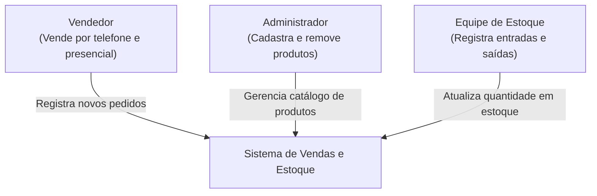
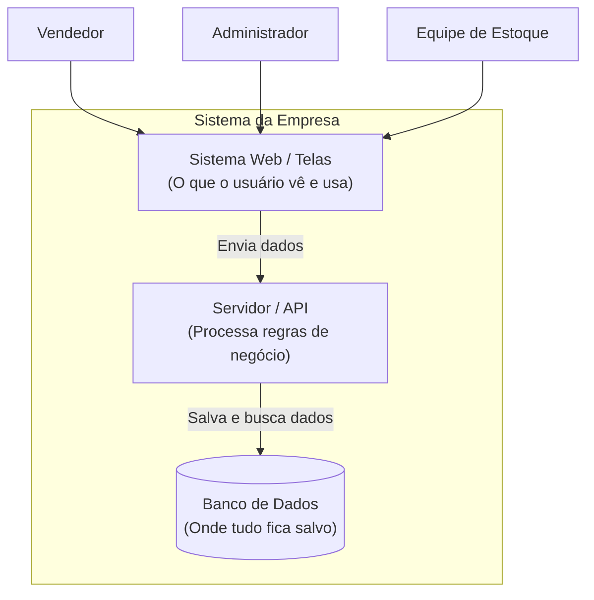
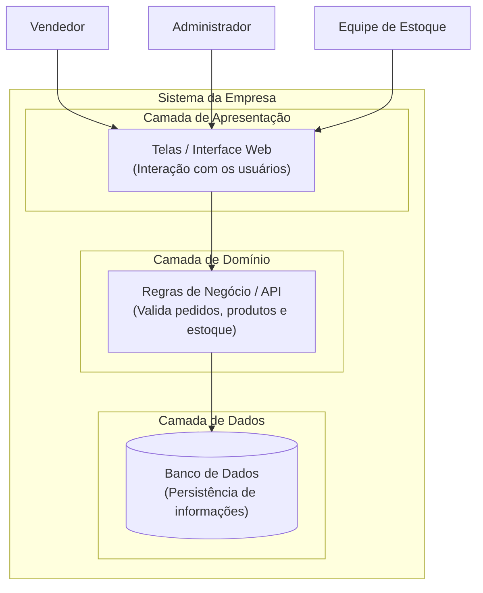

# Sua vez de arquitetar

Solução desenvolvida para o sistema de vendas e controle de estoque da empresa.

---

## 1. Diagrama de Contexto

Mostra quem usa o sistema e o que cada pessoa faz no dia a dia.

---

## 2. Diagrama de Contêineres

Mostra as partes principais que fazem o sistema funcionar e como elas conversam entre si.

---

## 3. Diagrama Anotado por Camadas

O mesmo sistema dividido nas três camadas clássicas de arquitetura: **Apresentação**, **Domínio** e **Dados**.

